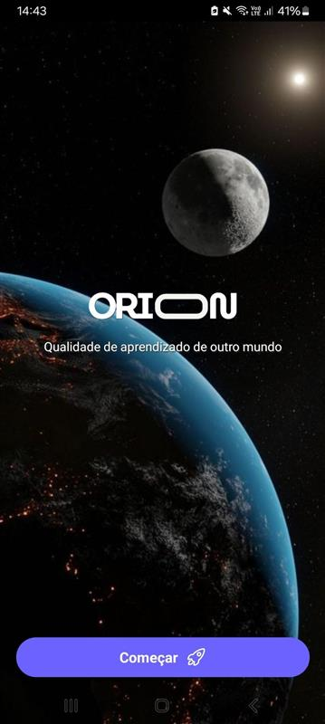
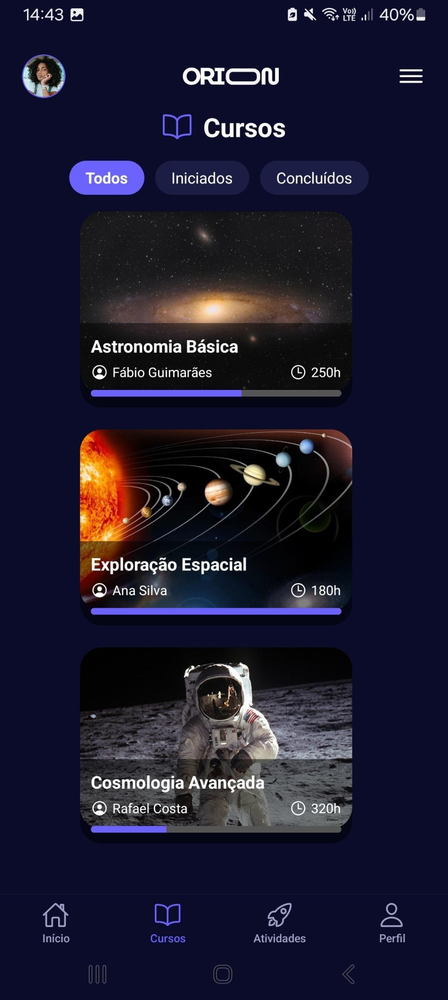
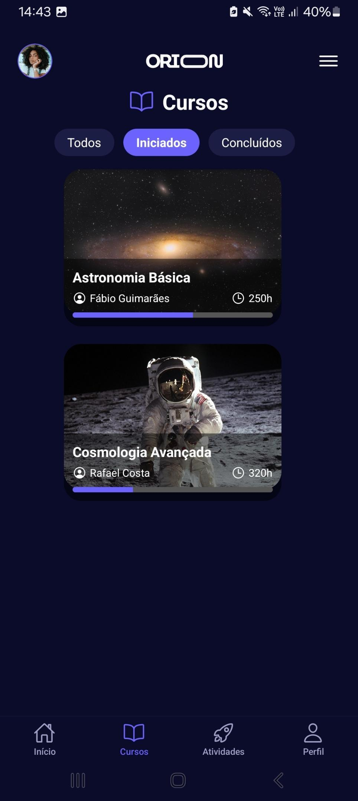
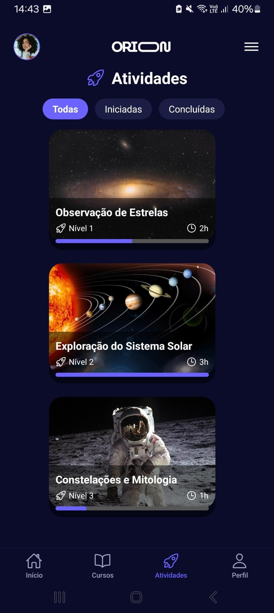
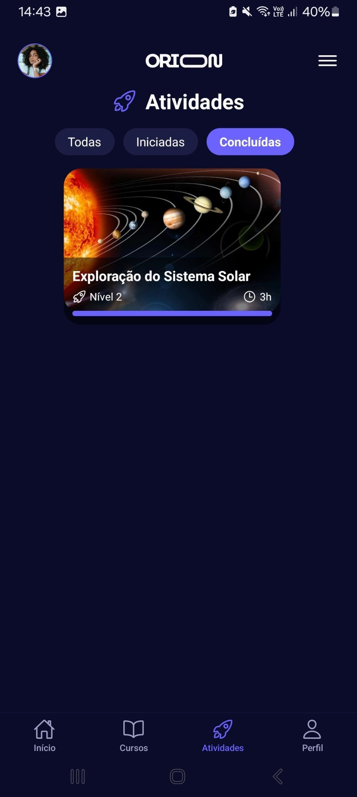
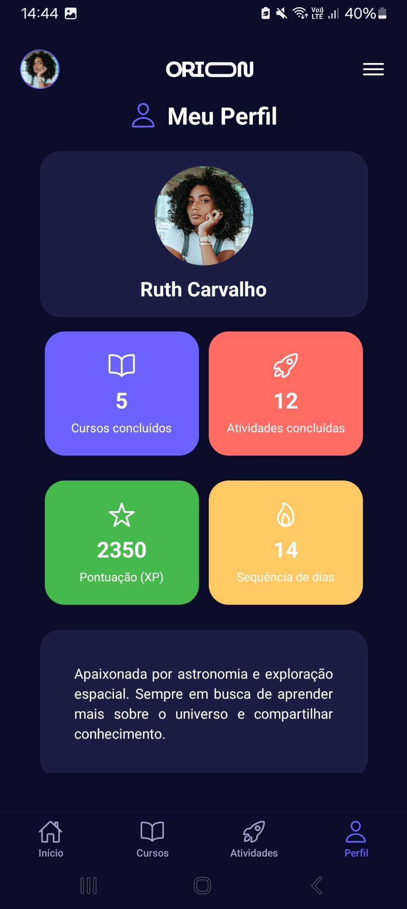
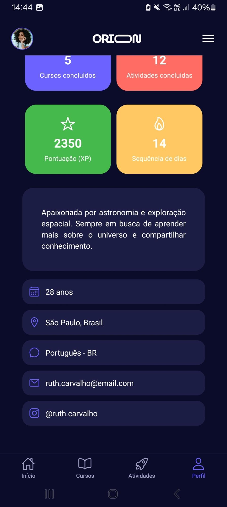
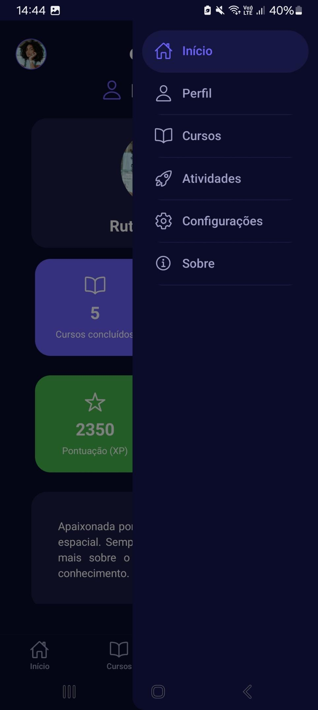
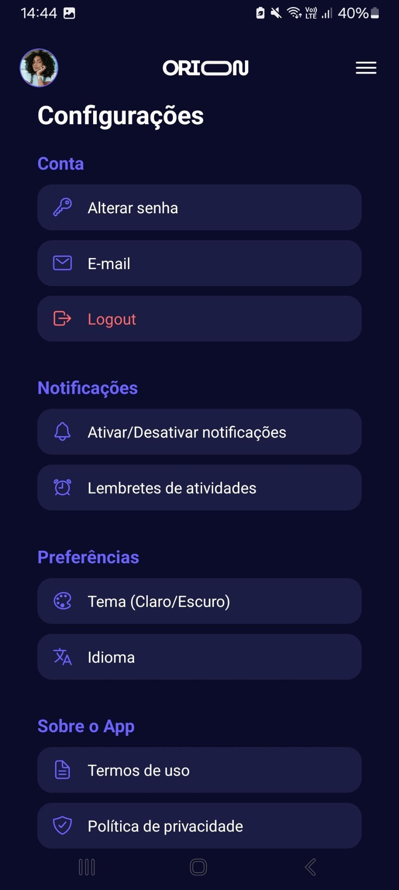
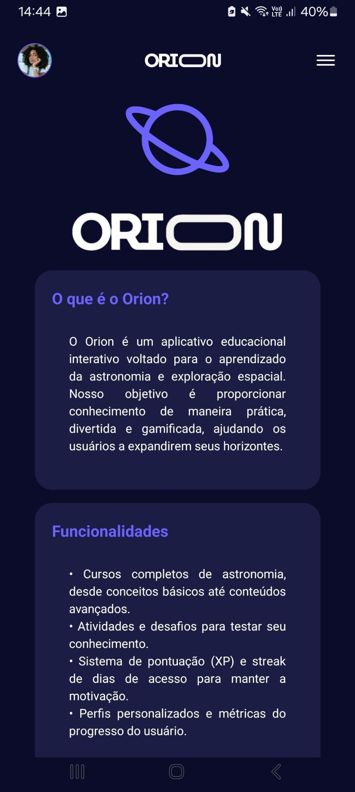

# Órion 🚀

Órion é um aplicativo educacional temático sobre astronomia, desenvolvido em **React Native + Expo**, que demonstra a integração de diferentes tipos de navegação: Stack, Drawer e Tab.
O app oferece uma experiência interativa, permitindo que usuários explorem cursos de Astronomia (ciência que estuda os corpos celestes e os fenômenos do universo, incluindo sua origem e desenvolvimento), acompanhem aulas detalhadas, realizem atividades e gerenciem seu progresso, tudo em uma interface intuitiva e envolvente. A aplicação foi desenvolvida para a disciplina de Programação para Dispositivos Móveis I em outubro de 2025.

## 🚀 Tecnologias utilizadas


<br />

## 📷 Screenshots

<div align="center">
    
    
    
    
    
    
    
    
    
    
    
    
</div>

<br />

## 👩🏽‍💻 Passos para executar

Você pode baixar este projeto em arquivo .zip, clicando no botão <b>Code</b>, ou então seguir os passos abaixo para clonar o repositório em seu dispositivo:

```bash
# Clone o repositório
$ git clone https://github.com/Debora-Carvalho/react-native-orion-app.git

# Entre na pasta do projeto
$ cd react-native-orion-app

# Instale as dependências
$ npm install
```
Executando pelo **Expo Go (dispositivo móvel)** 

- Instale o aplicativo Expo Go no seu celular (disponível na Google Play Store ou App Store). 

- No terminal, inicie o servidor do Expo: 

```bash
npm start
```

- Um QR code será exibido no terminal ou no navegador. 

- Abra o Expo Go no celular e escaneie o QR code. O aplicativo será carregado automaticamente no seu dispositivo. 

Executando pelo **Android Studio (emulador)** 

- Abra o Android Studio e crie um emulador Android (AVD) com a versão desejada do Android. 

- No terminal do projeto, execute: 

```bash
npm run android
```
- O projeto será compilado e aberto no emulador.

<br />

## Author

| [<br><sub>Débora Carvalho</sub>](https://github.com/Debora-Carvalho) |
| :---------------------------------------------------------------------------------------------------------------------------------------------------------------------------------------------: |
|                                                                [Linkedin](www.linkedin.com/in/debora-vieira-carvalho-45a478205)                                                                 |

<br />

Última atualização: out.2025